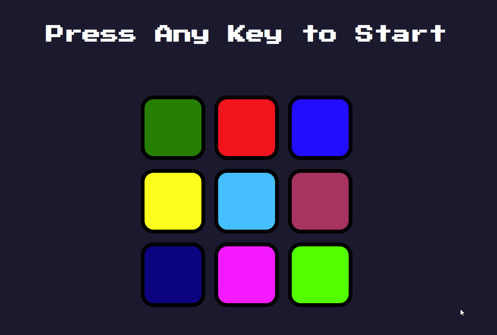

# Simon Game

Simon game implemented as a part of a challenge in the course: [The Complete 2020 Web Development Bootcamp](https://www.udemy.com/course/the-complete-web-development-bootcamp/) on [Udemy](https://www.udemy.com/).

[Play the game here](https://zcsain.github.io/simon-game/index.html)

Sample:

---

## Challenge - Start
Files that were provided at the beginning of the challenge:
  - styles.css
  - index.html
  - sounds

## Challenge - Finish
### Tasks to complete challenge:
  - [x] link index.js
  - [x] link jQuery
  - [x] implement pattern generation
  - [x] implement sound play
  - [x] implement button animation
  - [x] implement user input check
  - [x] implement game over logic

### Add-ons:
  - expanded grid to 3x3 (from original 2x2)
  - generated additional sounds for 3x3 grid
  - generated README.md
  - published game on GitHub Pages
  - added favicon
  - added title change on focus change

## Technologies used:
  - JS DOM manipulation
  - jQuery
  - html
  - CSS
